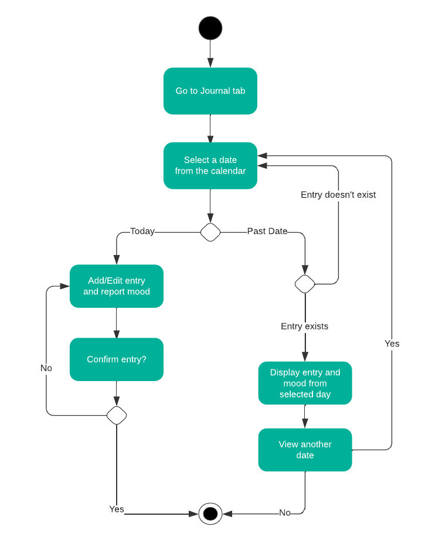
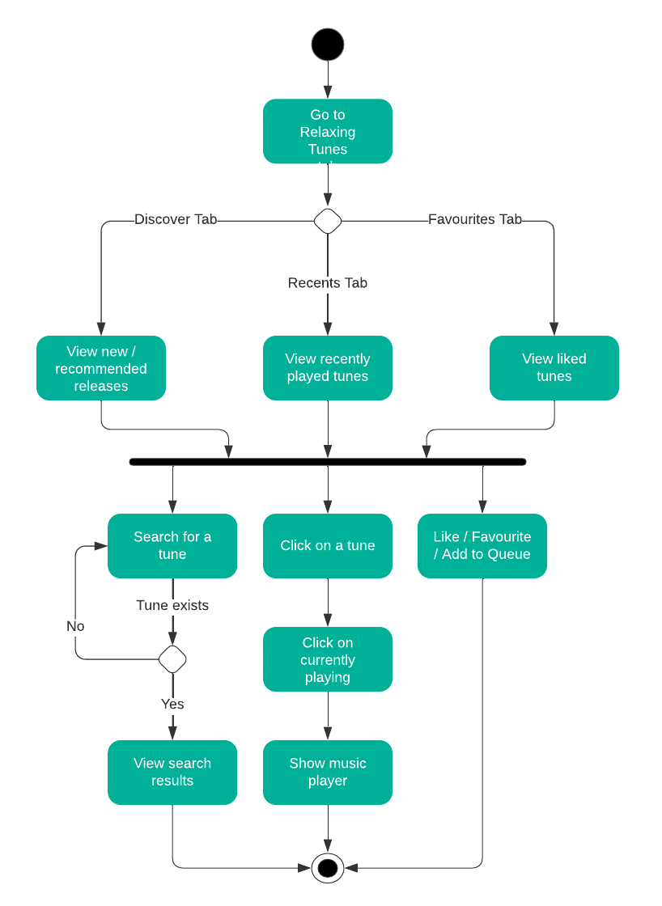
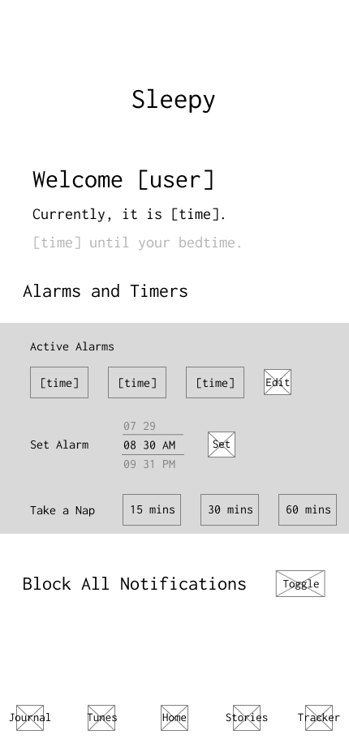
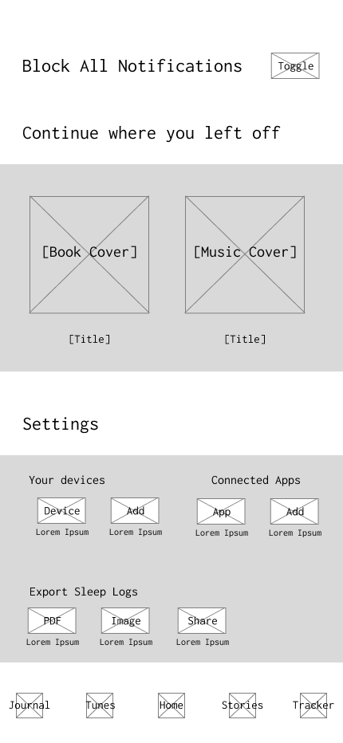
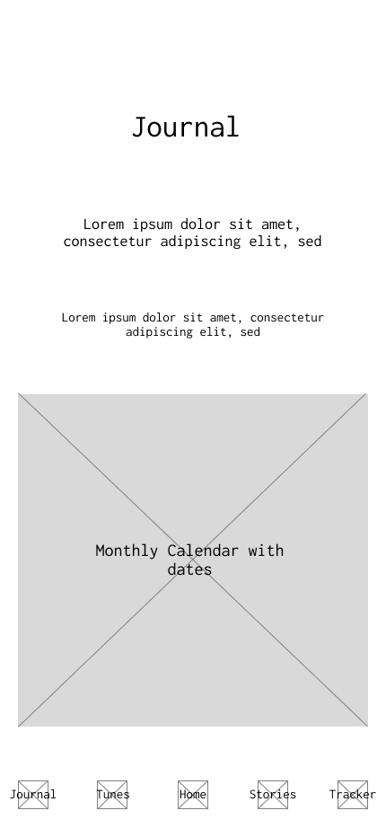
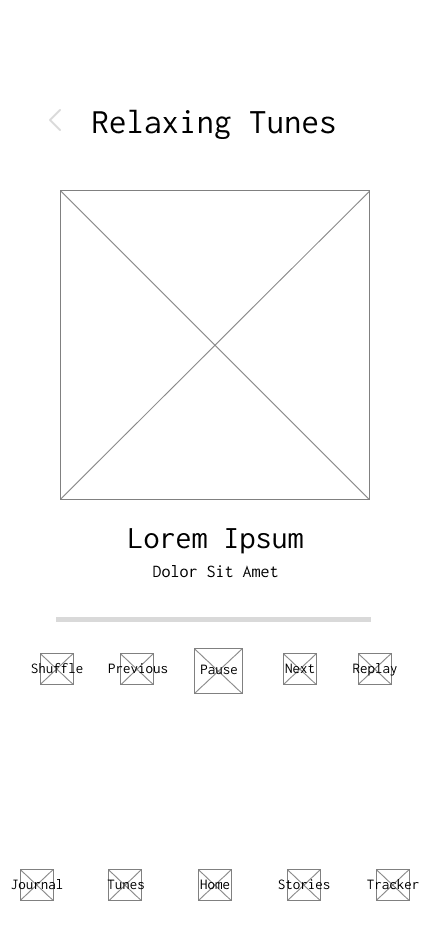

# Sleepy

## Team members

* [Aavishkar Gautam](https://github.com/aavishkar6)
* [Avaneesh Devkota](https://github.com/avaneeshdevkota)
* [Seolin Jung](https://github.com/seolinjung)
* [Soyuj Jung Basnet](https://github.com/basnetsoyuj)

## Ideation

As a team of college students juggling the demands of academics, professional commitments, and personal lives, we found ourselves all too familiar with the sacrifice of sleep. We recognized that this was a problem for all of us, but we wanted to make sure that poor sleep quality and non-existent sleep schedules weren't problems only for college students. Startling statistics from the _Center for Disease Control and Prevention_ reveal that approximately 1 in 3 adults in the United States consistently struggle to get adequate rest or sleep each day. This statistic was enough to convince us that this was a problem worth solving.  

By conducting [interviews](./interviews/) and observing [online communities](https://www.reddit.com/r/AskReddit/comments/7nme2t/redditors_who_have_trouble_sleeping_what_do_you/), we identified a series of issues that individuals commonly faced - struggle to fall asleep, irregular sleep patterns, lack of understanding of their sleep cycle, and difficulty relaxing their minds before bedtime.  

To address the issues identified, we brainstormed various features that could assist our target users. 

* White noise and relaxing tunes to mask distractions and create a calming ambience.
* A journaling component to help users empty their minds and process thoughts before sleep.
* An assortment of audiobooks to help users relax and shift their focus, offering a smooth transition into sleep.
* A sleep tracker to monitor sleep patterns providing key insights to user's sleeping habits.
* Alarms and power-nap schemes.

Combining all these features, we conceptualized an all-inclusive sleep companion app designed to promote peace of mind and quality sleep.

## Stakeholder Interviews

### Stakeholder A: Madeleine Berry

Madeleine is a college student in her 20s. Find the full interview [here](./interviews/berry.md).

| Goals                                                                                                 | Frustrations                                                                                 |
|-------------------------------------------------------------------------------------------------------|----------------------------------------------------------------------------------------------|
| Desire to understand and possibly diagnose sleep-related disorders using sleep tracking and analysis. | Anxiety and restlessness before bed affecting the sleep quality.                             |
| A need for guided meditation and white noise options.                                                 | Disruptions due to external noise and inappropriate room temperature.                        |
| An interest in a feature to reduce screen time before bed.                                            | Difficulty in managing screen time before bed.                                               |
| Effective alarm system to ensure timely wake-ups.                                                     | Difficulty in establishing a consistent sleep schedule due to irregular sleep-wake patterns. |

### Stakeholder B: Anil Dixit

Anil is a working dad in his late 30s with a newborn. Find the full interview [here](./interviews/dixit.md).

| Goals                                                             | Frustrations                                                                                     |
|-------------------------------------------------------------------|--------------------------------------------------------------------------------------------------|
| Fall asleep quicker, reducing the time spent lying awake in bed.   | The stress of work and a new-born disrupt his sleep.                                             |
| An effective way to distract his mind from the day's work stress. | Struggles with winding down before sleep due to his mind being active with thoughts.             |
| An understanding of his sleep patterns to improve sleep quality.  | The features of his current health gadget (Apple Watch) are too overwhelming to use effectively. |
| Practical advice on what can be done to enhance these patterns.   | Lack of an effective technique to document his thoughts before sleep.                            |

## Product Vision Statement

***Sleepy*** aims to promote deep, restful sleep through insomnia combatting tools like **white noise**, **reflective journaling**, and **soothing bedtime audiobooks** in addition to a **sleep tracker** that will offer invaluable insights into users' sleep patterns, allowing them to understand and address their sleep-related issues efficiently.

## User Requirements

_Sleepy_ is helpful for everyone.

| As                                            | I want                                                       | so that                                                                   |
|-----------------------------------------------|--------------------------------------------------------------|---------------------------------------------------------------------------|
| a shift worker                                | a sleep tracker that aligns with my irregular sleep patterns | I can get a better understanding of my sleep behaviour.                   |
| a busy professional                           | bedtime reminders                                            | I can maintain a regular sleep schedule and improve my work productivity. |
| a new mom                                     | soothing bedtime stories I could listen to with my baby      | it helps us both fall asleep.                                             |
| an overthinker                                | a reflective journaling feature                              | I can jot down my thoughts and clear my mind before going to bed.         |
| a frequent traveler across time zones         | to be suggested optimal sleep/wake times based on my jet lag | I can regain a normal sleep cycle.                                        |
| a freelancer working from home                | to block out all notifications during my sleeping hours      | my rest isn't disturbed by work calls or texts.                           |
| a senior citizen concerned about sleep health | detailed insights into my sleep patterns                     | I can discuss them with my doctor.                                        |
| an athlete                                    | weekly and monthly sleep quality reports                     | I can ensure my sleeping habits are not negatively affecting my training. |
| a student studying for exams                  | to be provided short power nap schemes                       | I get some rest without destroying my study schedule.                     |
| a therapy patient                             | to listen to calming tunes                                   | I can manage my anxiety before bed.                                       |

## Activity Diagrams

"As an overthinker, I want a reflective journaling feature so that I can jot down my thoughts and clear my mind before going to bed."

  

---

"As a therapy patient, I want to listen to calming tunes, so that I can manage my anxiety before bed."

  

## Wireframe Diagrams

### Home Screen

  
  

### Journal Screen

  

  
  

### Relaxing Tunes Screen

  
  

  
  

#### Stories Screen

  
  

  
  

#### Sleep Tracker Screen

  
  

## Clickable Prototype

Find the link [here](https://www.figma.com/proto/NKTLz6j5fHVPdWASghXcBT/Sleepy?page-id=104%3A1268&type=design&node-id=250-2929&viewport=1610%2C-453%2C0.59&t=cSuSE1dGTM8joaJG-1&scaling=scale-down&starting-point-node-id=250%3A2929&mode=design).

## Mockup

Find the link [here](https://www.figma.com/proto/NKTLz6j5fHVPdWASghXcBT/Sleepy?page-id=0%3A1&type=design&node-id=41-8172&viewport=1436%2C-821%2C1.8&t=7OV41Zt08Sj5Z0Xu-1&scaling=scale-down&starting-point-node-id=41%3A8172&mode=design).

#### Mockup Images

  

  
  

  
  

